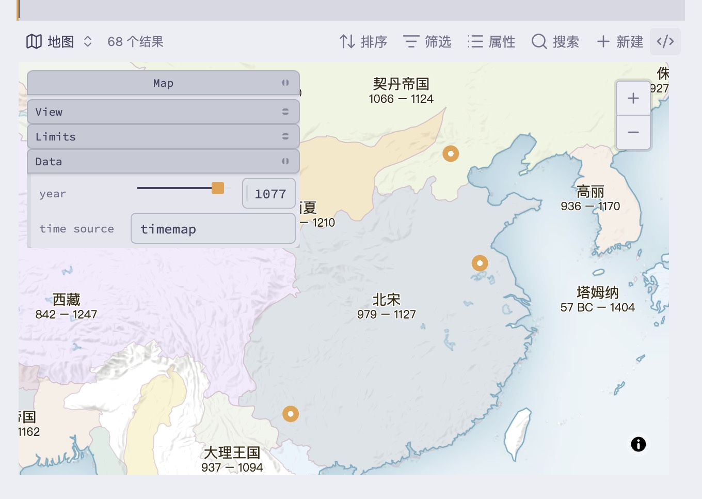

English | [中文说明](docs/readme-cn.md)

Requires [Obsidian 1.10](https://obsidian.md/changelog/2025-11-11-desktop-v1.10.3/).

## Map view for Obsidian Bases

Based on [Obsidian Maps](https://github.com/obsidianmd/obsidian-maps), with one key addition:

- Filter data by **year/time** (a second-stage filter on top of your Bases filters).

## Use cases

- When you have a historical map and want to view your notes/points across different years.

## Usage

There are two ways to use it.

### Option 1: Use in Bases

1. Configure your Bases filters.
2. Configure where coordinates come from (optional; defaults to the note property `coordinates`).
3. Configure the active year/time (optional; defaults to the note property `start`).

Example:

```base
filters:
  and:
    - author.contains(link("苏轼"))
views:
  - type: history-map
    name: map
    defaultYear: "1077"
```

Result:



### Option 2: Call the API

Recommended to use together with [Dataview](https://github.com/blacksmithgu/obsidian-dataview).

Example:

```dataviewjs
const points = dv().pages().where(p => {
	// custom filtering logic
	return selectTheRightFile(p);
}).filter(p => {
	// filter entries missing time or coordinates
	return !!p.start && !!p.coordinates;
});

// render via API
const historyMapApi = this.app.plugins.plugins["history-maps"].api;
historyMapApi.render(this.container, {
  year: 1077,
  points: points
})
```

Notes:

- Both approaches will filter out items missing **time** or **coordinates**. Make sure your data contains both.
- The sample map data comes from [history-maps](https://github.com/x-ideas/history-maps) and uses **PMTiles**. If you use a custom map, you can set the vector time source name via plugin settings or the map pane.
- Supported `year` types: `number`, `string`, and date-like values (e.g. `1077`, `"1077"`, `new Date(1077, 0, 1)`).

## Installation

Obsidian review can be slow; installing via BRAT is recommended.

### Install via BRAT (Beta Release Automation Tool)

- If you don't have BRAT, install it from: [BRAT](https://github.com/TfTHacker/obsidian42-brat)
- Enable the BRAT plugin
- Open the command palette and run **BRAT: Plugins: Add a beta plugin for test**
- Enter this repo URL: `https://github.com/x-ideas/obsidian-history-maps`
- Choose a version (latest recommended)
- Click **Add plugin**, then enable **History Maps**

## References

- Obsidian Bases map view docs: [Map view](https://help.obsidian.md/bases/views/map)
